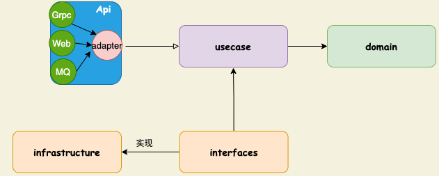

# 模块说明

- `domain`：定义内部的核心逻辑和业务，❗️该层不能引用其他层的数据
- `infrastructure`：包含支持该模块所有外部设施 —— 数据库，框架，工具等
- `interfaces`：定义支撑业务需要的外围功能
- `api`：外部模块的访问方式和view展现
- `usecase`
    1. 代表着某种场景下的业务逻辑
    2. 封装该模块的所有用例 —— 具有使用的自述性
    3. 转换外围数据与内部业务实体的格式，并协调其他服务共同完成用户的请求
    4. ❗️该层的变更不能影响业务实体domain
    5. ❗️该层的与外部因素隔离 —— 数据库，消息总线，框架等

# 依赖流的说明

